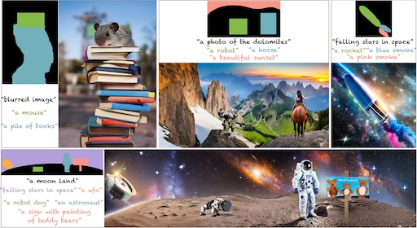

# MultiDiffusion: Fusing Diffusion Paths for Controlled Image Generation (ICML 2023)
## [<a href="https://multidiffusion.github.io/" target="_blank">Project Page</a>]

[](https://arxiv.org/abs/2302.08113)

[](https://huggingface.co/spaces/weizmannscience/MultiDiffusion)
[](https://replicate.com/cjwbw/multidiffusion)

[//]: # ([![Hugging Face Spaces]&#40;https://img.shields.io/badge/%F0%9F%A4%97%20Hugging%20Face-Spaces-blue&#41;]&#40;https://huggingface.co/spaces/weizmannscience/text2live&#41;)



**MultiDiffusion** is a unified framework that enables versatile and controllable image generation, using a pre-trained text-to-image diffusion model, without any further training or finetuning, as described in <a href="https://arxiv.org/abs/2302.08113" target="_blank">(link to paper)</a>.

[//]: # (. It can be used for localized and global edits that change the texture of existing objects or augment the scene with semi-transparent effects &#40;e.g. smoke, fire, snow&#41;.)

[//]: # (### Abstract)
>Recent advances in text-to-image generation with diffusion models present transformative capabilities in image quality. However, user controllability of the generated image, and fast adaptation to new tasks still remains an open challenge, currently mostly addressed by costly and long re-training and fine-tuning or ad-hoc adaptations to specific image generation tasks. In this work, we present MultiDiffusion, a unified framework that enables versatile and controllable image generation, using a pre-trained text-to-image diffusion model, without any further training or finetuning. At the center of our approach is a new generation process, based on an optimization task that binds together multiple diffusion generation processes with a shared set of parameters or constraints. We show that MultiDiffusion can be readily applied to generate high quality and diverse images that adhere to user-provided controls, such as desired aspect ratio (e.g., panorama), and spatial guiding signals, ranging from tight segmentation masks to bounding boxes.

For more see the [project webpage](https://multidiffusion.github.io).

## Diffusers Integration [](https://colab.research.google.com/github/omerbt/MultiDiffusion/blob/master/MultiDiffusion_Panorama.ipynb)
MultiDiffusion Text2Panorama is integrated into [diffusers](https://huggingface.co/docs/diffusers/main/en/api/pipelines/stable_diffusion/panorama), and can be run as follows:
```
import torch
from diffusers import StableDiffusionPanoramaPipeline, DDIMScheduler

model_ckpt = "stabilityai/stable-diffusion-2-base"
scheduler = DDIMScheduler.from_pretrained(model_ckpt, subfolder="scheduler")
pipe = StableDiffusionPanoramaPipeline.from_pretrained(
     model_ckpt, scheduler=scheduler, torch_dtype=torch.float16
)

pipe = pipe.to("cuda")

prompt = "a photo of the dolomites"
image = pipe(prompt).images[0]
```

## Gradio Demo 
We provide a gradio UI for our method. Running the following command in a terminal will launch the demo:
```
python app_gradio.py
```
This demo is also hosted on HuggingFace [here](https://huggingface.co/spaces/weizmannscience/MultiDiffusion)

## Spatial controls

A web demo for the spatial controls is hosted on HuggingFace [here](https://huggingface.co/spaces/weizmannscience/multidiffusion-region-based).

## Citation
```
@article{bar2023multidiffusion,
  title={MultiDiffusion: Fusing Diffusion Paths for Controlled Image Generation},
  author={Bar-Tal, Omer and Yariv, Lior and Lipman, Yaron and Dekel, Tali},
  journal={arXiv preprint arXiv:2302.08113},
  year={2023}
}
```
